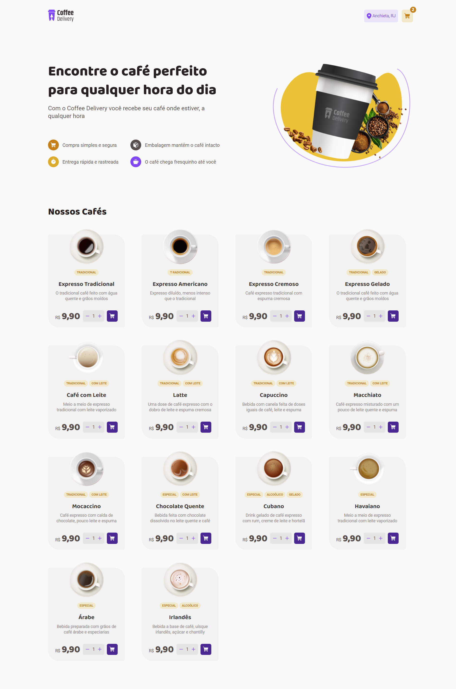
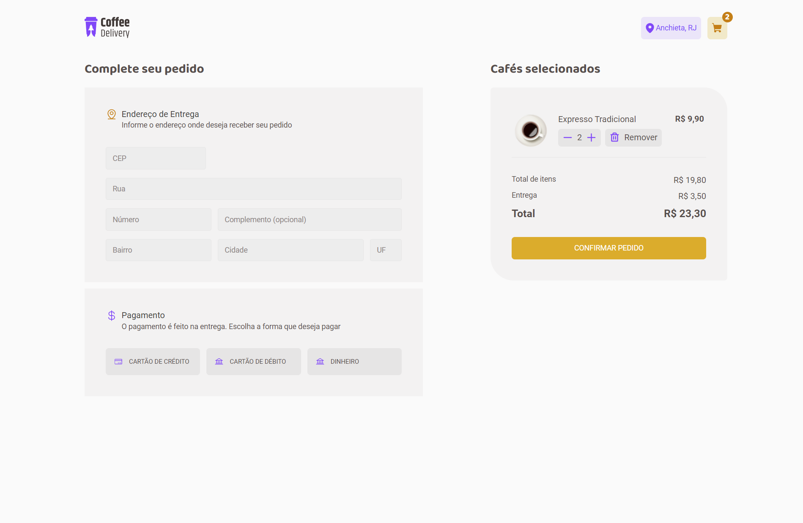
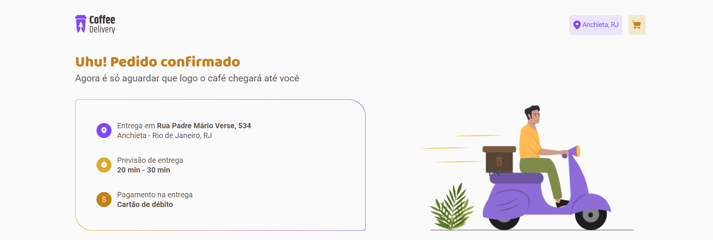

# coffe delivery (desafio 02) - Bootcamp Ignite - RocketSeat
### Home

### Shopping cart

### Success

> SPAs com ReactJS - Trilha 2022

Projeto desenvolvido como desafio para conclusão do módulo 2 do curso.

## 🔧 Tecnologias
- ReactJS
- TypeScript
- HTML
- CSS
- Git e Github
- Vite

## 📖 Bibliotecas
- React Router DOM
- React Hook Form
- Styled Components
- Zod
- Phosphor Icos

## ✉️ Contato
lauro.almeida@uniriotec.br